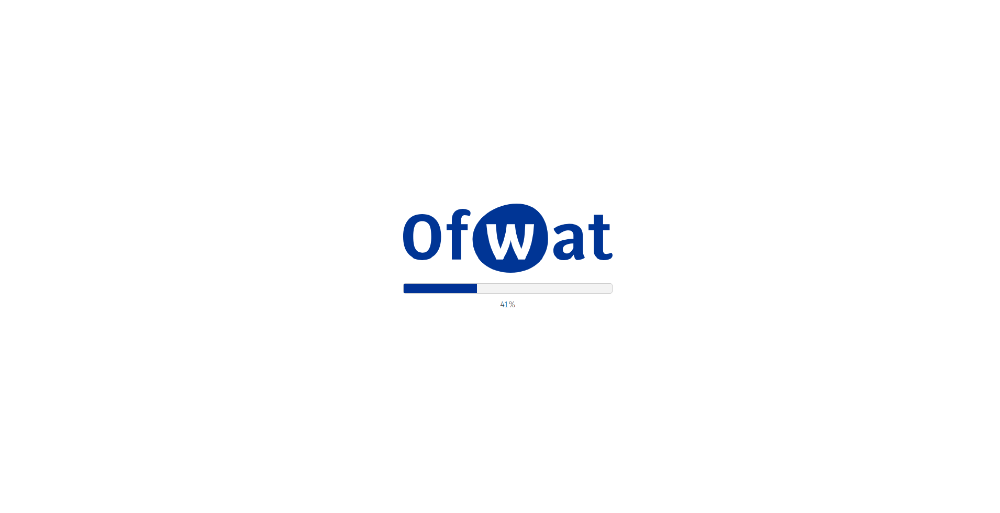
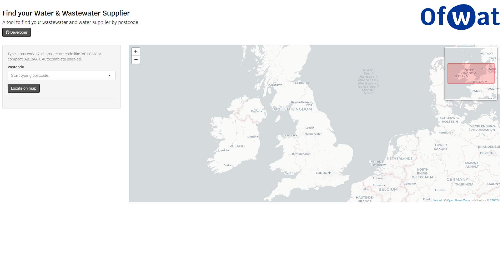
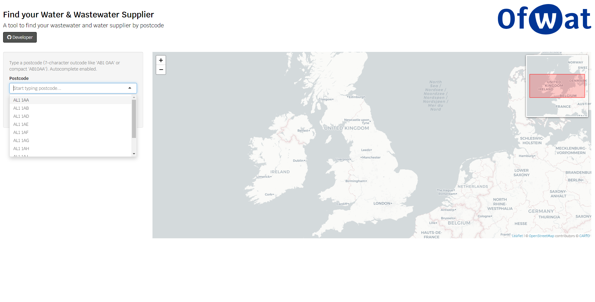
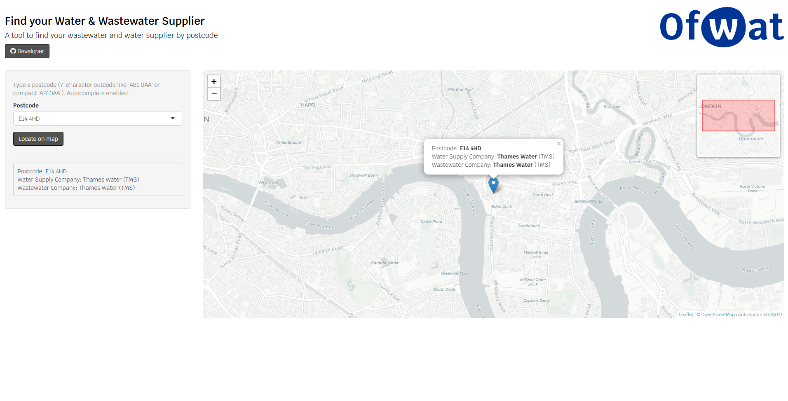

# Lookup your water company (wastewater and water supplier) using your postcode

This demo app helps the public find their water and wastewater supplier based on the ONS postcode database. Water company boundaries from the House of Common's library were initially corrected for topology errors (slivers and intersecting polygons). ONS data postcodes were used to create a point feature class based on northings and eastings. A geospatial intersect was used to match the water and wastewater supplier for each postcode, with the resultant point feature class used within the app. 

On load, the Ofwat loader will appear for a few seconds: 

The initial screen shows a text box to start to enter your postcode, which shows suggestions for autocomplete: 

After typing your postcode, click the highlighted code or click enter. This will reveal your company infomation on the side panel: 

To confirm the postcode on the map, click 'Locate on map'.  Clicking on the marker will show a popup with the water and wastewater supplier:

